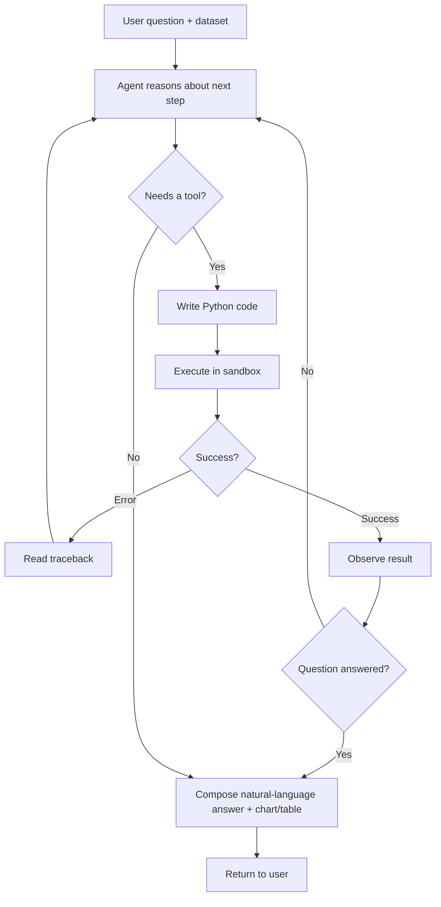
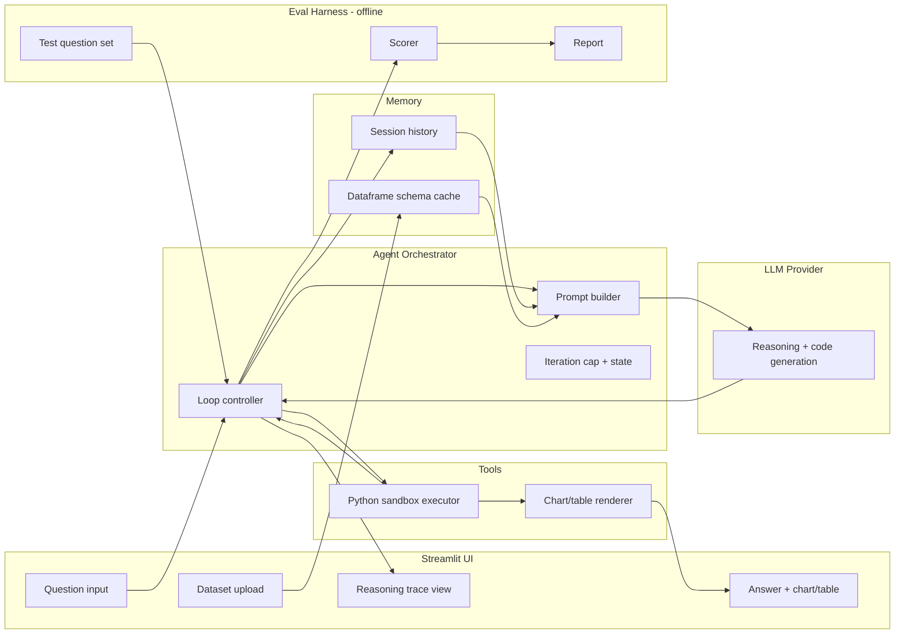
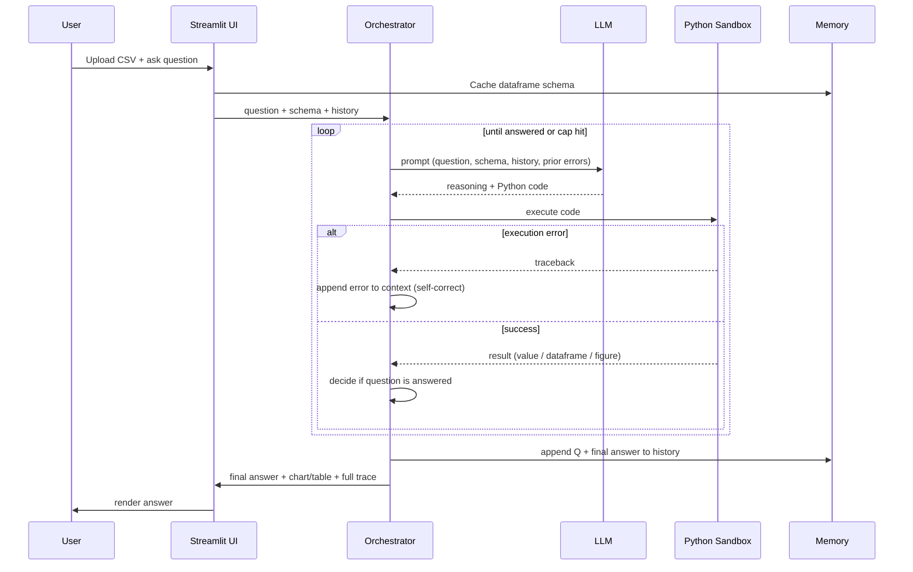

# Data-Analysis Agent — Project Documentation & System Design

**Project type:** Portfolio / learning project (AI Engineering)
**Author:** _[your name]_
**Status:** Design doc — v1
**One-line pitch:** An LLM agent that answers plain-English questions about a dataset by writing Python, executing it in a sandbox, reading its own errors, correcting itself, and returning an answer with the table or chart it produced.

---

## 1. The idea

You hand the agent a CSV (or a small SQLite database) and ask a question in natural language — *"which region grew fastest last quarter?"* or *"plot monthly active users and flag the biggest drop."* The agent doesn't just answer from the LLM's head. It:

1. Reasons about what needs to be computed.
2. Writes Python (pandas / matplotlib) to compute it.
3. Executes that code in a sandbox.
4. Observes the result — including errors.
5. If the code failed, reads the traceback and rewrites the code, then retries.
6. Repeats until it has a real, data-grounded result.
7. Answers in natural language, attaching the table or chart it generated.

The thing that makes this an *agent* and not a RAG pipeline or a single LLM call is the **loop**: reason → act → observe → correct → repeat. That loop, and especially the self-correction step, is the centerpiece of the whole project.

### Why this project (the honest reasoning)

- **It complements RAG experience instead of duplicating it.** RAG is retrieve-then-generate, essentially one shot. This project demonstrates planning, multi-step tool use, and recovery from failure — the things RAG *doesn't* show.
- **The self-correction loop demos beautifully.** Watching an agent hit a `KeyError`, read the traceback, and rewrite its own code is the moment that lands in an interview.
- **It's genuinely useful, not a toy.** "Ask questions of your data" is a real product category, which reads as maturity.
- **It scales in depth.** You can ship a minimal version fast and keep adding layers (planning, memory, guardrails, evals) as time allows — always having something demoable.

---

## 2. Goals and non-goals

### Goals
- Build the core agent loop **by hand** at least once, to understand it at a level most candidates don't.
- Make every design decision **defensible** in an interview (why this tool, why this retry policy, why this guardrail).
- Ship a **deployed, documented** artifact with a reasoning trace a viewer can watch.
- Add an **eval harness** — the differentiator that almost nobody at this level has.

### Non-goals
- Not building a general-purpose autonomous agent that browses the web, sends email, etc. Scope is deliberately narrow: data analysis over a provided dataset.
- Not optimizing for production-grade multi-tenant scale. This is a portfolio project; correctness, clarity, and defensibility beat scale.
- Not fine-tuning a model. Uses a hosted LLM via API.

---

## 3. Core concept: the agent loop

The heart of the system is a control loop, often described as **ReAct** (Reason + Act):



The two feedback edges are what make it an agent:
- **G → B (self-correction):** an error becomes new input the agent reasons about.
- **H → B (multi-step):** an intermediate result feeds the next step for questions that take more than one action.

A **max-iteration cap** guards both loops so the agent can never run forever.

---

## 4. System architecture



### Layer responsibilities

| Layer | Responsibility |
|---|---|
| **UI (Streamlit)** | Take the question + dataset, stream the agent's reasoning trace, render the final answer with any chart/table. |
| **Orchestrator** | Owns the loop. Builds prompts, calls the LLM, dispatches tool calls, feeds results/errors back, enforces the iteration cap, tracks state. This is the code you hand-roll. |
| **LLM provider** | Does the reasoning and writes the Python. Called statelessly; all context is passed in each turn. |
| **Tools** | The Python sandbox (executes generated code, captures stdout/stderr/return value) and the renderer (turns a dataframe/figure into something the UI shows). |
| **Memory** | Session history (prior Q&A this session) and a cached schema of the loaded dataframe (column names, dtypes, sample rows) so the agent writes correct code without re-inspecting every time. |
| **Eval harness** | Offline. Runs a fixed set of questions with known answers through the agent and scores accuracy. Not in the live request path. |

---

## 5. Request lifecycle (one question, end to end)



---

## 6. Component detail

### 6.1 Orchestrator (the loop controller)
The core object. Pseudocode for the loop:

```
function run(question, schema, history):
    context = build_initial_context(question, schema, history)
    for step in 1..MAX_STEPS:
        response = llm(context)                 # reasoning + maybe code
        if response.has_final_answer:
            return response.answer
        code = response.code
        result = sandbox.execute(code)
        if result.error:
            context += observation(result.traceback)   # self-correction
        else:
            context += observation(result.output)      # multi-step
    return best_effort_answer(context)          # cap reached
```

Design points to be ready to defend:
- **Why a step cap?** Prevents infinite loops and runaway cost. A reasonable default is 5–8 steps.
- **Why pass full context each turn?** The LLM is stateless; the orchestrator is the memory.
- **How is "answered" decided?** The model signals completion (e.g. emits a final-answer marker) rather than the orchestrator guessing.

### 6.2 Python sandbox executor
Executes LLM-written code and captures stdout, stderr, exceptions, and any produced dataframe/figure.

- **Isolation:** run in a restricted subprocess (or a container), not in the app process. Never `exec()` untrusted code in your main runtime.
- **Timeouts:** kill runaway code (e.g. an accidental infinite loop the model wrote).
- **Whitelisted libraries:** pandas, numpy, matplotlib — no filesystem-wide access, no network.
- **Return contract:** a structured result `{ok, stdout, error_traceback, value, figure}` the orchestrator can branch on.

This is your **guardrails** story, and interviewers love asking "what stops it running dangerous code?"

### 6.3 Self-correction mechanism
When `sandbox.execute` returns an error, the traceback is appended to the context as an observation, and the loop continues. The model now sees: *"I wrote this, it failed with this error"* and rewrites. Cap the retries so a persistently-broken question fails gracefully instead of looping.

This is the single most impressive part of the demo — invest here.

### 6.4 Memory
- **Session history:** prior questions and answers, so follow-ups like *"now break that down by month"* work.
- **Schema cache:** column names, dtypes, and a few sample rows of the loaded data, injected into the prompt so the model writes correct column references without re-inspecting the dataframe every turn.

### 6.5 Eval harness (the differentiator)
Offline script, separate from the app:
- A fixed set of ~15–30 questions over a known dataset, each with an expected answer (or a checker function).
- Runs each through the agent, compares output to expected, computes an accuracy score.
- Produces a small report. Now you can say *"my agent scores X% on my eval set, and I improved it from Y% by doing Z."*

This maps directly to how serious AI teams (and labs) actually work, and almost no one at the junior level has it.

---

## 7. Tech stack

| Concern | Choice | Why |
|---|---|---|
| Language | Python | It's the language of the ecosystem; you build fluency by doing. |
| LLM access | Hosted API (Anthropic / OpenAI / etc.) | No infra to manage; swap providers freely. |
| Agent loop | **Hand-rolled** first | Understand the loop by feeling it, not importing it. Mention a framework as a bonus. |
| Data | pandas + SQLite | Standard, expected, universally understood. |
| Sandbox | subprocess with timeout, or a container | Safe execution of generated code. |
| UI | Streamlit | Pure-Python UI, free deploy, fast to build. No frontend needed. |
| Charts | matplotlib | Simple, renders in Streamlit. |
| Deploy | Streamlit Community Cloud | Free, one-click, good enough for a portfolio demo. |
| Evals | Plain Python script | Keep it simple and readable. |

---

## 8. Suggested directory structure

```
data-analysis-agent/
├── README.md                 # the front door — architecture, demo GIF, live link
├── requirements.txt
├── .env.example              # API key placeholder (never commit real keys)
├── app.py                    # Streamlit UI
├── agent/
│   ├── orchestrator.py       # the loop controller
│   ├── prompts.py            # prompt templates
│   ├── memory.py             # session history + schema cache
│   └── tools/
│       ├── sandbox.py        # safe Python executor
│       └── render.py         # chart/table rendering
├── evals/
│   ├── dataset.csv           # known test data
│   ├── questions.py          # questions + expected answers
│   └── run_evals.py          # scorer + report
└── docs/
    └── architecture.md       # this design, trimmed
```

---

## 9. Build plan (levels)

Each level is shippable on its own — you always have something to demo.

**Level 1 — Core loop.** One tool (sandbox). Question → code → execute → answer. The reason–act–observe cycle working end to end. This alone is a real agent.

**Level 2 — Self-correction.** Feed tracebacks back in; agent retries and fixes itself; add a retry cap. *Spend real time here — it's the money shot.*

**Level 3 — Planning / multi-step.** For harder questions, agent decomposes into steps (load → inspect → compute → visualize) before acting. Demonstrates task decomposition.

**Level 4 — Seniority signals.** Session memory, safe-execution guardrails, and a Streamlit UI that shows the reasoning trace. Deploy it.

**Level 5 — Evals.** The eval harness and a before/after accuracy story. Your standout.

---

## 10. Interview design targets

Build each level so you can answer these cold:

- **"Why an agent here and not a single LLM call or RAG?"** → The task needs multiple dependent steps, tool use, and recovery from failure — a one-shot call can't do that.
- **"What happens when it gets stuck in a loop?"** → Iteration cap + graceful best-effort answer.
- **"How do you stop it running dangerous code?"** → Sandboxed subprocess, timeouts, whitelisted libs, no network/filesystem.
- **"How does it recover from a bad answer / bug?"** → Traceback fed back as an observation; the self-correction loop.
- **"How do you know it actually works?"** → The eval harness and the accuracy number.
- **"How would you scale / productionize this?"** → Persistent memory store, async execution, a real container sandbox, streaming, cost controls, observability.

The rule that ties it together: **build things you can defend to any depth.** A modest agent you understand completely beats a flashy one you can't explain.

---

## 11. Future extensions (talk about these as "what's next")

- Swap the CSV tool for a live database connection (read-only).
- Add a retrieval tool so it can answer questions that mix data + documents (ties back to your RAG strength).
- Multi-agent: a planner agent + an executor agent.
- Streaming reasoning trace token-by-token.
- Cost/latency tracking per question in the trace.

---

## 12. Definition of done (portfolio-ready)

- [ ] Deployed and reachable via a live link.
- [ ] README with architecture diagram, a demo GIF, and the eval number.
- [ ] Self-correction visibly working in the demo.
- [ ] Reasoning trace viewable in the UI.
- [ ] Eval harness runs and reports a score.
- [ ] You can defend every design decision above without notes.
