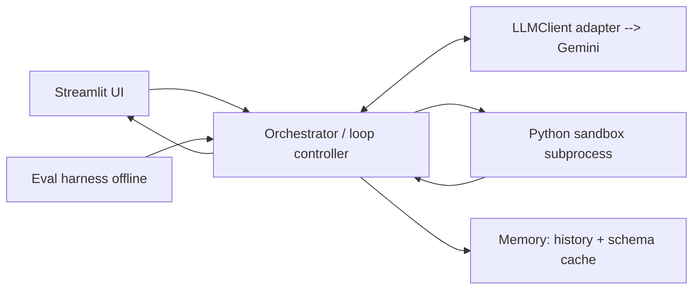

# Data-Analysis Agent — Implementation Plan (`plan.md`)

**Status:** v1 — execution plan derived from [data-analysis-agent-design-doc.md](data-analysis-agent-design-doc.md)
**Owner:** _[your name]_
**LLM provider:** Google **Gemini** (via the `google-genai` SDK)
**Driving principle:** Ship a demoable slice at every level; make every decision defensible to any depth.

---

## 0. How to read this document

The design doc says *what* we're building and *why*. This plan says *how*, in what *order*, and how we'll *know each piece works*. It is written to be executed top-to-bottom: interfaces first, then a sandbox, then the loop, then self-correction, then UI/memory, then evals.

The single most important engineering idea here: **we define the contracts between components (Section 5) before writing behavior.** Once `ExecutionResult`, `Step`, and `AgentRun` are fixed, the sandbox, orchestrator, UI, and eval harness can be built and tested independently.

---

## 1. Objectives & non-objectives

### Objectives (what "done" means)
1. A **hand-rolled ReAct loop**: reason → write Python → execute in a sandbox → observe → self-correct → repeat, capped by a max-iteration guard.
2. **Self-correction** that visibly recovers from a traceback (the money-shot demo).
3. A **safe sandbox** that executes model-written Python out of process, with a timeout, an import allow-list, and no network.
4. A **Streamlit UI** that streams the reasoning trace and renders the final answer plus any table/chart.
5. An **offline eval harness** with a fixed question set, automatic scoring, and a before/after accuracy story.
6. **Provider-swappable LLM layer** — Gemini today, another provider behind the same interface tomorrow.

### Non-objectives (explicitly out of scope for v1)
- No general-purpose autonomous agent (no web browsing, email, file writes outside the sandbox workdir).
- No multi-tenant scale, auth, or user accounts.
- No fine-tuning. Hosted Gemini via API only.
- **No use of Gemini's server-side `code_execution` tool** — see §7 for the rationale (guardrails + self-correction must run in our sandbox).

---

## 2. Tech stack & key decisions (decision log)

| Concern | Choice | Rationale / defense |
|---|---|---|
| Language | Python 3.11+ | Ecosystem for pandas/matplotlib; the sandbox worker is also Python. |
| LLM | Gemini via `google-genai` SDK | User-provided Gemini API key. `google-genai` is Google's current unified SDK (`from google import genai`). |
| Default model | `gemini-3.6-flash` (configurable) | Verified against the actual key: Pro tiers (`gemini-2.5/3/3.1-pro`) require paid quota (429 on free tier) and `gemini-2.5-flash` 404s for new keys, so the default is the latest Flash. Gemini 3.x needs thought-signature round-tripping (implemented). **Model IDs rotate — re-check against Google AI Studio.** |
| Tool-calling style | Native **function calling**, loop hand-rolled | We own the loop (pedagogy + control), but use structured function calls (`run_python`) instead of regex-parsing markers. Robust and defensible. |
| Code execution | **Our** subprocess sandbox, NOT Gemini code-execution tool | The sandbox + self-correction + guardrails are the project's centerpiece and its safety story. Delegating to Google's server-side executor removes all three. |
| Data | pandas + optional SQLite | Standard, expected, universally understood. |
| Sandbox isolation | Subprocess + timeout + import allow-list + no network | Simple, cross-platform (works on Windows), defensible. Container is a documented "what's next." |
| UI | Streamlit | Pure-Python, free deploy, shows the trace with no frontend work. |
| Charts | matplotlib (Agg backend) | Renders to PNG in the sandbox; Streamlit displays the PNG. |
| Config | `pydantic-settings` + `.env` | Typed config; `GEMINI_API_KEY` never committed. |
| Tests | `pytest` | Unit + integration; LLM mocked in unit tests. |
| Lint/format | `ruff` (+ format) | One tool, fast. |
| Deploy | Streamlit Community Cloud | Free one-click; secrets via Streamlit secrets manager. |
| Packaging | `requirements.txt` (+ `pyproject.toml` optional) | Simple, Streamlit-Cloud-friendly. |

**Provider abstraction.** All Gemini calls go through an `LLMClient` protocol (`llm/base.py`). The orchestrator never imports `google.genai` directly. Swapping providers = one new adapter class.

---

## 3. Architecture (recap + deltas from the design doc)

The layered architecture from the design doc (§4) stands unchanged: **UI → Orchestrator → LLM → Tools (sandbox/render) → Memory**, plus an offline **Eval harness**. Deltas introduced by this plan:

- The **LLM provider box is Gemini**, reached through an `LLMClient` adapter.
- The **Tools box has one real tool at Level 1** (`run_python`); the renderer is a UI concern that consumes `ExecutionResult`, not a model-facing tool.
- "Answered" is signalled by the model emitting a **`final_answer`** (either a dedicated function call or a plain text turn with no `run_python` call — decided in §6).



---

## 4. Repository structure

```
data-analysis-agent/
├── README.md                     # front door: architecture, demo GIF, eval number, live link
├── requirements.txt
├── pyproject.toml                # optional: ruff/pytest config, package metadata
├── .env.example                  # GEMINI_API_KEY=...   (never commit the real key)
├── .gitignore                    # .env, __pycache__, .pytest_cache, artifacts/
├── app.py                        # Streamlit entrypoint
├── config.py                     # pydantic-settings: model, MAX_STEPS, TIMEOUT_S, etc.
├── agent/
│   ├── __init__.py
│   ├── types.py                  # ExecutionResult, Step, AgentRun, ToolCall (the contracts)
│   ├── orchestrator.py           # the hand-rolled loop controller
│   ├── prompts.py                # system prompt + prompt-building helpers
│   ├── memory.py                 # SessionMemory (history) + SchemaCache
│   ├── llm/
│   │   ├── __init__.py
│   │   ├── base.py               # LLMClient protocol + shared request/response types
│   │   └── gemini.py             # Gemini adapter (function calling)
│   └── tools/
│       ├── __init__.py
│       ├── sandbox.py            # host side: spawn worker, enforce timeout, parse envelope
│       ├── worker.py             # runs INSIDE the subprocess; execs code; emits JSON envelope
│       └── render.py             # ExecutionResult -> Streamlit renderables (table/chart)
├── evals/
│   ├── __init__.py
│   ├── dataset.csv               # known test data
│   ├── questions.py              # Question objects: prompt + checker fn / expected value
│   ├── run_evals.py              # runs each question through the agent, scores, reports
│   └── reports/                  # generated: report_<timestamp>.md / .json (gitignored or kept)
├── tests/
│   ├── test_sandbox.py
│   ├── test_orchestrator.py      # LLM mocked
│   ├── test_memory.py
│   ├── test_gemini_adapter.py    # LLM mocked / contract tests
│   └── test_evals.py
├── artifacts/                    # runtime scratch: figures, temp data (gitignored)
└── docs/
    └── architecture.md           # trimmed design doc for the repo
```

---

## 5. Core interfaces / data contracts (build these FIRST)

These live in `agent/types.py` and `agent/llm/base.py`. Everything else depends on them. Fix them before writing behavior; change them deliberately.

### 5.1 Tool execution result — `ExecutionResult`
The sandbox's structured return contract. The orchestrator branches on `ok`.

```python
@dataclass(frozen=True)
class ExecutionResult:
    ok: bool                       # True if code ran without an uncaught exception
    stdout: str                    # captured stdout (truncated to a cap, e.g. 8000 chars)
    error_traceback: str | None    # full traceback string if ok is False, else None
    result_kind: str               # "none" | "scalar" | "dataframe" | "series" | "figure"
    result_repr: str | None        # repr/str of the `result` variable (truncated)
    dataframe_preview: str | None   # markdown/CSV of df.head(N) when result is a frame
    figure_path: str | None        # path to a saved PNG when a matplotlib figure was produced
    execution_time_s: float
    timed_out: bool = False
```

### 5.2 One agent step — `Step`
Records a single loop iteration for the trace and the UI.

```python
@dataclass
class Step:
    index: int
    thought: str | None            # model's reasoning text for this turn (if surfaced)
    action: str                    # "run_python" | "final_answer"
    code: str | None               # generated code when action == "run_python"
    observation: ExecutionResult | None
    final_answer: str | None       # set when action == "final_answer"
```

### 5.3 Whole run — `AgentRun`
The object the UI renders and the eval harness scores.

```python
@dataclass
class AgentRun:
    question: str
    steps: list[Step]
    final_answer: str | None
    status: str                    # "answered" | "cap_reached" | "error"
    figure_path: str | None        # last figure produced, for convenience
    final_table_md: str | None     # last dataframe preview, for convenience
    usage: dict                    # token counts / latency (best effort)
```

### 5.4 LLM abstraction — `LLMClient` (`agent/llm/base.py`)
Provider-agnostic. The Gemini adapter implements it.

```python
@dataclass
class LLMToolCall:
    name: str                      # "run_python" | "final_answer"
    args: dict                     # {"code": "..."} or {"answer": "..."}

@dataclass
class LLMResponse:
    text: str | None               # assistant natural-language text, if any
    tool_call: LLMToolCall | None  # the requested tool call, if any
    raw: object                    # provider-native response, for debugging
    usage: dict

class LLMClient(Protocol):
    def generate(
        self,
        system_prompt: str,
        history: list[dict],       # provider-neutral turn list (see §6.3)
        tools: list[dict],         # tool schemas in a neutral shape
    ) -> LLMResponse: ...
```

**Acceptance for §5:** `types.py` and `base.py` import cleanly; a throwaway script can construct each dataclass. No behavior yet.

---

## 6. LLM integration (Gemini function calling)

### 6.1 SDK basics (pin against current docs at build time)
- Install: `pip install google-genai`
- Client: `from google import genai` → `client = genai.Client(api_key=settings.gemini_api_key)` (SDK also reads `GEMINI_API_KEY`/`GOOGLE_API_KEY`).
- Call: `client.models.generate_content(model=..., contents=..., config=...)`.
- `config` (via `google.genai.types.GenerateContentConfig`) carries `system_instruction`, `tools`, `temperature`, `thinking_config`, etc.

### 6.2 Tools we declare to the model
Two function declarations (no server-side code execution tool):

- `run_python(code: str)` — "Execute Python (pandas/numpy/matplotlib) against the loaded dataframe `df`. Returns stdout, any error traceback, and a preview of the `result` variable."
- `final_answer(answer: str)` — "Provide the final natural-language answer to the user once the data question is fully answered."

We use **manual** function calling: we read the model's `function_call` part, dispatch it ourselves, and append a `function_response` part on the next turn. We do **not** enable the SDK's automatic function calling (it would run the loop for us and hide it — we want the loop hand-rolled and the code routed to our sandbox).

### 6.3 Provider-neutral history shape
The orchestrator maintains history as a list of neutral turn dicts; the Gemini adapter translates to `types.Content`/`types.Part`:

```
{"role": "user",  "text": "<question + schema on turn 0>"}
{"role": "model", "tool_call": {"name": "run_python", "args": {"code": "..."}}}
{"role": "tool",  "tool_result": {"name": "run_python", "content": {<ExecutionResult subset as JSON>}}}
...
```

The adapter maps: user/model text → `types.Content(role=...)`; tool_call → a `function_call` part; tool_result → a `function_response` part.

### 6.4 Thinking & determinism
- Gemini 2.5 models think by default. Use a modest `thinking_config` if we want to surface or bound reasoning; keep it simple in v1.
- Set a low `temperature` (e.g. 0–0.2) for reproducible code generation, important for stable evals.

### 6.5 Adapter responsibilities (`gemini.py`)
- Build `config` (system instruction + tool declarations + temperature).
- Translate neutral history ↔ Gemini `contents`.
- Extract the first `function_call` (or text) from the response into `LLMResponse`.
- Surface token usage (`response.usage_metadata`) and latency into `usage`.
- Map SDK/quota errors to a small set of internal exceptions the orchestrator can handle (retryable vs fatal).

**Acceptance for §6:** with a live key, a one-shot script sends a trivial question, gets back a `run_python` tool call, and prints the code. With no key, `test_gemini_adapter.py` exercises the translation logic against a stubbed response.

---

## 7. Sandbox design (the guardrails story)

### 7.1 Threat model
The model writes Python we did not review. We must prevent: filesystem tampering outside a workdir, network calls (exfiltration/SSRF), unbounded CPU/loops, and crashing the host app process.

### 7.2 Design
Run generated code in a **separate Python process** (`agent/tools/worker.py`) launched by `agent/tools/sandbox.py`:

1. Host serialises the dataframe once per session to `artifacts/<session>/df.parquet` (fallback pickle).
2. Host writes the model's code to a temp file and spawns `python worker.py --data df.parquet --code code.py` with:
   - `subprocess.run(..., timeout=TIMEOUT_S)` — kills runaway code.
   - A **minimal environment** (scrubbed env vars; `MPLBACKEND=Agg`).
   - `cwd` set to the session artifacts dir.
3. The **worker**:
   - Installs an **import allow-list** guard (`pandas`, `numpy`, `matplotlib`, `math`, `statistics`, `datetime`, `json`, `re`). A custom `__import__`/import hook raises on anything else (esp. `os`, `sys`, `socket`, `subprocess`, `requests`, `pathlib` writes, `open` in write mode).
   - Loads `df`, `exec`s the model code in a controlled namespace exposing `df`, `pd`, `np`, `plt`.
   - Captures stdout/stderr; captures the `result` variable if defined; if a matplotlib figure exists, saves it to `figure.png`.
   - Prints a single **JSON envelope** on stdout (last line) that maps directly to `ExecutionResult`.
4. Host parses the envelope → `ExecutionResult`. On timeout → `ExecutionResult(ok=False, timed_out=True, error_traceback="Execution timed out after Ns")`.

### 7.3 Return contract (worker → host)
```json
{"ok": true, "stdout": "...", "error_traceback": null,
 "result_kind": "dataframe", "result_repr": "...",
 "dataframe_preview": "| col | ... |", "figure_path": "figure.png",
 "execution_time_s": 0.42}
```

### 7.4 Honest limitations (document, don't hide)
- Subprocess isolation is not a security boundary against a determined attacker; import allow-listing is defense-in-depth, not a jail. Network blocking is best-effort (import-level) on the base plan.
- **"What's next":** a real container sandbox (Docker/gVisor) with `--network none`, read-only rootfs, CPU/memory cgroups, and a non-root user. Called out in README + docs as the productionisation path.

**Acceptance for §7:** `test_sandbox.py` proves: (a) valid code returns `ok=True` with correct stdout/result; (b) a `KeyError` returns `ok=False` with a traceback; (c) an infinite loop hits the timeout and returns `timed_out=True`; (d) `import os` (or `import requests`) is rejected; (e) a matplotlib figure produces a PNG and `result_kind="figure"`.

---

## 8. Prompt design (`agent/prompts.py`)

- **System prompt** defines the role ("data analyst that answers by writing Python against a dataframe `df`"), the tool contract (`run_python`, `final_answer`), the rules (assign the answer to a `result` variable; use matplotlib for charts; never fabricate numbers; when you have the answer, call `final_answer`), and the failure protocol (on a traceback, read it and fix the code).
- **Schema block** injected on turn 0: column names, dtypes, row count, and 3–5 sample rows (from `SchemaCache`) so the model writes correct column references without re-inspecting.
- **Observation formatting**: tool results are fed back compactly — stdout (truncated), traceback (full but capped), and a short dataframe preview — so the model sees exactly what happened.

**Acceptance for §8:** golden-file test asserts the system prompt and a rendered schema block match a snapshot; prompt builder is pure (no I/O).

---

## 9. Memory (`agent/memory.py`)

- `SchemaCache` — computed once on dataset upload: `columns`, `dtypes`, `n_rows`, `sample_rows`. Injected into prompts.
- `SessionMemory` — prior `(question, final_answer)` pairs this session, so follow-ups ("now break that down by month") work. Stored in Streamlit `session_state`.
- Keep it in-memory for v1; a persistent store is a documented "what's next."

**Acceptance for §9:** `test_memory.py` verifies schema extraction from a sample CSV and that history append/retrieval round-trips.

---

## 10. Eval harness (`evals/`) — the differentiator

- `dataset.csv` — a known, small dataset (e.g. regional sales by month).
- `questions.py` — ~15–30 `Question` objects, each with a `prompt` and a `checker`:
  - **Exact** for integers/labels; **tolerance** for floats (`abs(got-exp) < eps`); **contains** for phrasing; optional **LLM-judge** checker for open-ended answers (kept minimal).
- `run_evals.py` — runs each question through the *same* `Orchestrator` used by the app (no divergence), records pass/fail + steps + latency + tokens, writes `reports/report_<ts>.{md,json}`, prints an accuracy summary.
- The before/after story: record the score, make an improvement (better prompt, retry cap tuning), re-run, report the delta.

**Acceptance for §10:** `run_evals.py` executes end-to-end on the sample dataset and emits a report with an accuracy number; `test_evals.py` unit-tests the checkers (exact/tolerance/contains).

---

## 11. Milestones (phased delivery — each is demoable)

Mapped to the design doc's five levels. Each milestone lists tasks and **acceptance criteria** (the gate to move on).

### M0 — Scaffolding (½ day)
- Repo structure, `requirements.txt`, `.env.example`, `.gitignore`, `config.py`, ruff + pytest configured.
- `agent/types.py` + `agent/llm/base.py` (the contracts).
- **Acceptance:** `pytest` runs (0 tests ok), `ruff check` clean, config loads `GEMINI_API_KEY` from `.env`.

### M1 — Core loop (Design doc Level 1)
- `sandbox.py` + `worker.py` (happy path + timeout).
- `gemini.py` adapter (single `run_python` + `final_answer`).
- `orchestrator.py`: build context → call LLM → dispatch `run_python` → feed observation → repeat until `final_answer` or `MAX_STEPS`.
- Minimal CLI or script entry to run one question end-to-end.
- **Acceptance:** a real question ("how many rows?") produces code, executes, and returns a grounded answer. `test_orchestrator.py` (LLM mocked) proves one full reason→act→observe→answer cycle and the step cap.

### M2 — Self-correction (Design doc Level 2 — invest here)
- Feed tracebacks back as observations; verify the model rewrites and recovers.
- Add a **retry/step cap** and graceful `status="cap_reached"` best-effort answer.
- **Acceptance:** an intentionally hard question (needs a fix after a first-try `KeyError`) shows the agent recovering within the cap. `test_orchestrator.py` includes a mocked sequence: error → corrected code → success, asserting the traceback appears in the next prompt.

### M3 — Multi-step / planning (Design doc Level 3) ✅ implemented
- **Explicit planning:** a third tool, `plan(steps: string[])`, lets the model lay out ordered sub-tasks *before* computing. The prompt tells it to plan first for multi-part questions and skip planning for simple one-shot ones (so easy questions cost no extra call). The plan is stored on `AgentRun.plan` / a `Step(action="plan")` and rendered in the CLI trace and the UI (📋).
- **Staying on track:** while a plan is active, each observation carries a compact `plan_reminder` so the agent addresses *every* part before calling `final_answer` — the fix for a multi-part question stopping after the first part.
- Multiple dependent `run_python` calls (inspect → compute → visualize) are driven by intermediate observations, as before.
- Chart path: model produces a figure; `ExecutionResult.figure_path` set.
- **Step budget:** default `max_steps` raised 6 → 8 (still within the design doc's 5–8) so a planned, multi-part run has room to finish.
- **Acceptance:** covered by `test_orchestrator.py` (plan → execute → answer; plan fed back into history; messy plan cleaned; unplanned simple path unchanged) and `test_gemini_adapter.py` (array-of-strings param maps to a Gemini ARRAY schema). "plot X and flag the biggest drop" yields a chart + a correct textual flag across ≥2 steps.

### M4 — Seniority signals: UI + memory + guardrails polish (Design doc Level 4)
- **UI ✅** — Two front-ends over the same Orchestrator: a hand-built **FastAPI web app** (`web/`) that streams the reasoning trace as NDJSON with inline charts, and a **Streamlit** app (`app.py`). Both render each `Step` live.
- **Session memory ✅** — `agent/memory.py` (`SessionMemory`/`Turn`) carries prior question→answer turns into the next question's context via `build_initial_user_message(..., memory)`, so follow-ups ("plot that", "just the BMWs") resolve. Surfaced as a multi-turn conversation thread in the web app (with a *New conversation* reset + `/api/reset`), a "🗑 New conversation" button in Streamlit, and an interactive `python main.py --chat` in the CLI. Memory is conversational, not computational (the sandbox is stateless per run); persisting the kernel namespace is a documented future step. `SchemaCache` deferred (not needed yet).
- Sandbox hardening: import deny-list enforced + tests; env scrub; per-session artifact isolation. (Container isolation remains the documented hardening path, §7.)
- **Deploy** — still to do (Streamlit Community Cloud or a host for the FastAPI app; secrets = `GEMINI_API_KEY`). Note: a public URL spends the free-tier daily quota.
- **Acceptance:** uploading a CSV and asking a question shows the streamed trace, self-correction, and a rendered chart/table; a **follow-up question uses prior context** (covered by `test_memory.py` + `test_orchestrator.py::test_run_seeds_prior_conversation_into_first_message` + `test_web.py::test_memory_persists_and_seeds_followups`). Live URL is the remaining open item.

### M5 — Evals (Design doc Level 5 — standout)
- Build `evals/` (dataset, ~20 questions, checkers, runner, report).
- Produce a baseline score, make one measured improvement, record the before/after.
- **Acceptance:** `python -m evals.run_evals` prints an accuracy % and writes a report; README quotes the number and the improvement story.

---

## 12. Testing strategy

- **Unit (fast, no network):**
  - `test_sandbox.py` — success / error / timeout / disallowed-import / figure (§7 acceptance).
  - `test_orchestrator.py` — mocked `LLMClient`: happy path, self-correction sequence, step-cap → `cap_reached`.
  - `test_gemini_adapter.py` — neutral-history ↔ Gemini translation against stubbed responses; error mapping.
  - `test_memory.py`, `test_evals.py` — schema extraction, history, checkers.
- **Integration (optional, gated on a live key):** one end-to-end run behind a `pytest.mark.live` marker skipped in CI when `GEMINI_API_KEY` is absent.
- **CI (nice-to-have):** GitHub Actions running `ruff check` + `pytest -m "not live"`.
- **Test doubles:** a `FakeLLM(LLMClient)` returning scripted `LLMResponse`s is the backbone of orchestrator tests — no tokens spent, deterministic.

---

## 13. Observability & logging

- The `AgentRun`/`Step` objects *are* the trace — one structure serves the UI and the eval report.
- Structured logging (`logging` + a JSON formatter) at step boundaries: step index, action, code hash, `ok`, `execution_time_s`, tokens.
- Per-question totals: step count, total latency, total tokens (from Gemini `usage_metadata`) surfaced in the UI and the eval report — supports the "cost/latency per question" future extension.

---

## 14. Configuration & secrets

`config.py` (pydantic-settings), values from `.env` / Streamlit secrets:

| Setting | Default | Notes |
|---|---|---|
| `gemini_api_key` | — (required) | `GEMINI_API_KEY`; never committed. |
| `gemini_model` | `gemini-3.6-flash` | Latest Flash (free-tier accessible). Override to a Pro model if you have paid quota. |
| `max_steps` | `8` | Loop cap (design doc suggests 5–8); 8 leaves a planned, multi-part run room to finish. |
| `sandbox_timeout_s` | `15` | Kill runaway code. |
| `temperature` | `0.1` | Low for reproducible code/evals. |
| `stdout_char_cap` | `8000` | Truncate observations. |

`.env.example` ships with `GEMINI_API_KEY=` and safe defaults. `.gitignore` excludes `.env`, `artifacts/`, caches.

---

## 15. Deployment

- **Streamlit Community Cloud**: point at `app.py`; set `GEMINI_API_KEY` in the app's secrets. Pin `requirements.txt`.
- Confirm the sandbox subprocess model works in the Streamlit Cloud container (it does — it's just `python worker.py`); matplotlib uses the `Agg` backend (no display).
- README includes: architecture diagram, demo GIF, eval number, live link.

---

## 16. Risks & mitigations

| Risk | Likelihood | Mitigation |
|---|---|---|
| Gemini model IDs / SDK params drift | Med | Pin versions; isolate all SDK usage in `gemini.py`; verify against current Google docs at M1. |
| Sandbox isn't a true security jail | Med | Be explicit about it; import allow-list + timeout + env scrub as defense-in-depth; document container path. |
| Model loops without converging | Med | `MAX_STEPS` cap + graceful `cap_reached`; low temperature; tight prompts. |
| Flaky evals from model nondeterminism | Med | Low temperature; tolerance/contains checkers; keep an exact-match core set. |
| Big dataframes blow up latency/tokens | Low-Med | Schema-only in prompt (never the full frame); previews capped; parquet on disk, not in context. |
| Windows-specific subprocess quirks | Low | Use `subprocess.run` with explicit `timeout`; avoid POSIX-only signals; test on Windows early. |
| Token/quota cost during dev + evals | Low | Latest Flash for iteration; cache schema; cap steps. Free-tier RPM limits can 429 under bursty runs — space out or add backoff. |

---

## 17. Definition of done (portfolio-ready)

- [ ] Deployed and reachable via a live link.
- [ ] README with architecture diagram, demo GIF, and the eval number.
- [ ] Self-correction visibly working in the demo (traceback → fixed code).
- [ ] Reasoning trace viewable in the UI.
- [ ] Eval harness runs and reports a score, with a before/after improvement.
- [ ] Every decision above defensible without notes.

---

## 18. Task backlog (checklist)

**M0 — Scaffolding**
- [ ] Create repo structure (§4), `requirements.txt`, `.env.example`, `.gitignore`.
- [ ] `config.py` with pydantic-settings + `GEMINI_API_KEY`.
- [ ] `agent/types.py` (ExecutionResult, Step, AgentRun).
- [ ] `agent/llm/base.py` (LLMClient, LLMToolCall, LLMResponse).
- [ ] ruff + pytest configured; empty test run green.

**M1 — Core loop**
- [ ] `agent/tools/worker.py` (exec + envelope + figure save).
- [ ] `agent/tools/sandbox.py` (spawn + timeout + parse).
- [ ] `agent/llm/gemini.py` (function calling, translation, usage).
- [ ] `agent/prompts.py` (system prompt + schema block + observation formatting).
- [ ] `agent/orchestrator.py` (the loop + step cap).
- [ ] `test_sandbox.py`, `test_orchestrator.py` (happy path + cap).
- [ ] Script/CLI: run one question end-to-end.

**M2 — Self-correction**
- [ ] Feed traceback back as observation; verify recovery.
- [ ] Retry/step cap + graceful `cap_reached`.
- [ ] Orchestrator test: error → corrected code → success.

**M3 — Multi-step / charts**
- [ ] Multi-`run_python` questions driven by observations.
- [ ] Figure path wired through `ExecutionResult`.
- [ ] `render.py` for tables/charts.

**M4 — UI + memory + guardrails + deploy**
- [ ] `app.py`: upload, question, streamed trace, answer + chart/table.
- [ ] `SessionMemory` + `SchemaCache` wired.
- [ ] Import allow-list + env scrub + per-session artifacts + tests.
- [ ] Deploy to Streamlit Cloud with secret.

**M5 — Evals**
- [ ] `evals/dataset.csv`, `questions.py`, checkers.
- [ ] `run_evals.py` + report generation.
- [ ] Baseline → improvement → before/after in README.

**Docs**
- [ ] `docs/architecture.md` (trimmed design).
- [ ] README: diagram, GIF, eval number, live link.

---

## 19. Suggested build order (one line)

Contracts (§5) → sandbox (§7) → Gemini adapter (§6) → orchestrator loop (M1) → self-correction (M2) → multi-step/charts (M3) → UI/memory/guardrails/deploy (M4) → evals (M5) → docs.
